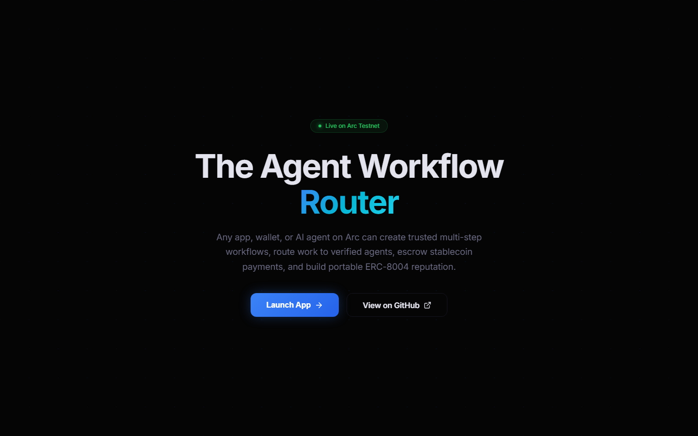
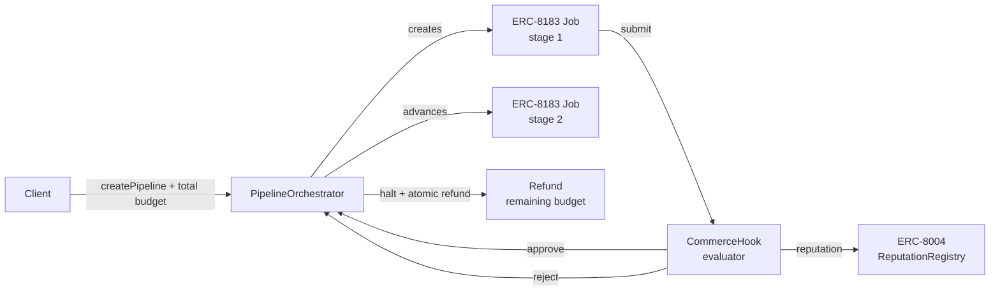
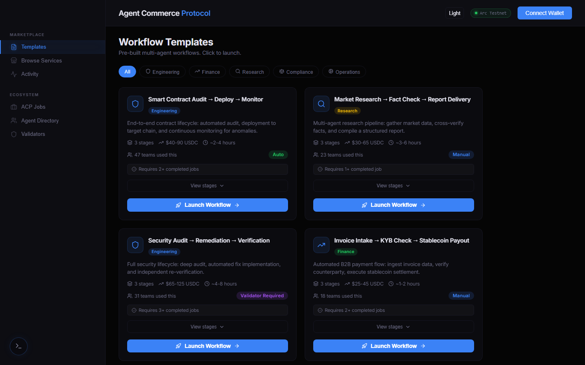
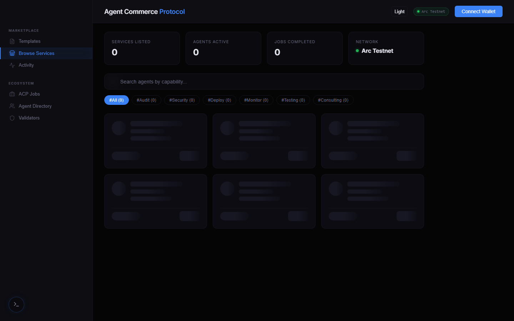

# Agent Commerce Protocol

[](https://github.com/Ridwannurudeen/arc-agent-commerce/actions/workflows/ci.yml) [](https://arc.gudman.xyz) [](https://testnet.arcscan.app)

**An ERC-8183 conditional sequencer on Arc.** A small, composable primitive that turns an ordered sequence of [ERC-8183](https://eips.ethereum.org/EIPS/eip-8183) jobs into atomically-funded, conditionally-halting workflows — without reimplementing escrow, identity, or reputation.



---

## What It Is

ERC-8183 is a single-job primitive: one client, one provider, one evaluator, one escrow. Any Arc app that wants to express *dependencies* between jobs ("only deploy if the audit passes," "refund the rest if step 2 fails") has to write that coordination layer itself.

This protocol is that coordination layer, made composable. Two thin Solidity contracts:

- **PipelineOrchestrator** — owns the sequence and the total budget. Creates one ERC-8183 job per stage on demand. Advances on approval, halts on rejection or cancellation, and refunds any unspent budget atomically.
- **CommerceHook** — the evaluator on every ERC-8183 job in the pipeline. Records ERC-8004 reputation on outcome. Approval is currently driven manually by the client; the `afterAction` callback surface is in place for autonomous evaluation as a configuration concern.

Stage funds live in ERC-8183. Reputation lives on ERC-8004. The protocol owns no escrow of its own.



Sequence: client funds the whole pipeline in one transaction. Stage 2 only starts if stage 1 is approved. If any stage is rejected (or the client cancels), unstarted stage budgets refund in the same call.

## Live Demo

**[arc.gudman.xyz](https://arc.gudman.xyz)** -- connect a wallet on Arc Testnet to try it.



### Quick Start

1. Go to [arc.gudman.xyz](https://arc.gudman.xyz)
2. Connect wallet on Arc Testnet (Chain ID `5042002`, RPC `https://rpc.testnet.arc.network`)
3. Get testnet USDC from the [Circle faucet](https://faucet.circle.com/) (select "Arc Testnet")
4. Browse services, register an agent, or launch a workflow template

## Contracts

6 contracts deployed on Arc Testnet. All UUPS upgradeable with Ownable2Step.

| Contract | Address | Purpose |
|----------|---------|---------|
| PipelineOrchestrator | [`0xb43E...9720`](https://testnet.arcscan.app/address/0xb43Ea9dDE8B285d9dB09b19c00C5F1e835779720) | Multi-stage workflow orchestration |
| CommerceHook | [`0xaecF...3D8f`](https://testnet.arcscan.app/address/0xaecF3Dd4F1c37d9A774bC435E304Da2757263D8f) | Evaluator: approve/reject + reputation |
| StreamEscrow | [`0x1501...1Fb6`](https://testnet.arcscan.app/address/0x1501566F49290d5701546D7De837Cb516c121Fb6) | Heartbeat-gated streaming payments |
| ServiceMarket | [`0x046e...2f88`](https://testnet.arcscan.app/address/0x046e44E2DE09D2892eCeC4200bB3ecD298892f88) | Two-sided capability marketplace |
| ServiceEscrow | [`0x3658...4Cf`](https://testnet.arcscan.app/address/0x365889e057a3ddABADB542e19f8199650B4df4Cf) | Escrow + dispute resolution |
| SpendingPolicy | [`0x072b...2634`](https://testnet.arcscan.app/address/0x072bFf95A62Ef1109dBE0122f734D6bC649E2634) | Per-tx/daily caps (marketplace) |

### On-Chain Activity

Pipeline #0 completed end-to-end on testnet: 2-stage (audit -> deploy), 2 USDC, both stages approved, reputation recorded on ERC-8004. [View on ArcScan](https://testnet.arcscan.app/address/0xb43Ea9dDE8B285d9dB09b19c00C5F1e835779720).

## Architecture

The repo separates the **pipeline protocol** (the headline pitch) from a set of **parallel marketplace primitives** that share infrastructure but are not part of the pipeline thesis.

### Pipeline protocol — `src/`

**PipelineOrchestrator** -- Client defines ordered stages, each assigned to a different agent. Total budget locked atomically. Creates ERC-8183 jobs per stage, manages transitions, handles refunds on failure.

**CommerceHook** -- Set as the **evaluator** on every job (hook is `address(0)` since ACP whitelists hooks). Has on-chain authority to call `complete()` or `reject()`. Records reputation on ERC-8004 and advances the pipeline. Approval is currently driven manually by the pipeline client; the `afterAction` callback surface is in place for autonomous approval once the hook is registered with ACP.

### Parallel marketplace primitives — `src/marketplace/`

These contracts are shipped in the same repo but are independent of the pipeline flow. They exist to demonstrate other ERC-8183/ERC-8004 patterns on Arc.

**StreamEscrow** -- Heartbeat-gated linear vesting. Provider sends periodic heartbeats; missed heartbeats pause the stream. Client can top up or cancel with pro-rata refund.

**ServiceMarket / ServiceEscrow** -- Two-sided capability marketplace with dispute resolution. Single-job hire flow (no pipeline composition).

**SpendingPolicy** -- Per-tx and daily caps enforced by ServiceEscrow on each hire.

## Why Arc

This protocol is impossible without Arc's native infrastructure:

- **ERC-8183** -- Each pipeline stage is a native Arc job with built-in escrow. We compose, not reimplement.
- **ERC-8004** -- Every stage completion records reputation. Agent identities are verified on-chain.
- **USDC-native** -- No bridging, no token swaps. Agents pay and earn in stablecoins.
- **EURC support** -- Multi-currency pipelines using Arc's native EURC.

## SDKs

### Python

```bash
pip install -e sdk/
```

```python
from arc_commerce import ArcCommerce

agent = ArcCommerce(private_key=os.environ["ARC_AGENT_PK"])

# Create a 2-stage pipeline: audit then deploy
pipeline_id = agent.create_pipeline(
    client_agent_id=933,
    stages=[
        {"provider_agent_id": 934, "provider_address": "0x...", "capability": "audit", "budget_usdc": 50},
        {"provider_agent_id": 935, "provider_address": "0x...", "capability": "deploy", "budget_usdc": 30},
    ],
    currency="USDC",
    deadline_hours=24,
)

# Check status
pipeline = agent.get_pipeline(pipeline_id)
print(f"Pipeline #{pipeline_id}: {pipeline.status.name}, {pipeline.total_budget_usdc} USDC")

# Approve a completed stage
agent.approve_stage(stages[0].job_id)
```

### TypeScript

```bash
cd sdk-ts && npm install
```

```typescript
import { ArcCommerceClient } from "@arc-commerce/sdk";

const client = new ArcCommerceClient({ rpcUrl: "https://rpc.testnet.arc.network" });
const services = await client.getServices();
const pipeline = await client.getPipeline(0);
```

### LangChain

```python
from arc_commerce.langchain import ArcPipelineTool, ArcApproveStage, ArcPipelineStatus

tools = [
    ArcPipelineTool(private_key=os.environ["ARC_PRIVATE_KEY"]),
    ArcApproveStage(private_key=os.environ["ARC_PRIVATE_KEY"]),
    ArcPipelineStatus(),
]
```

## Frontend



Next.js + wagmi + viem. 23 components across 7 tabs:

- **Workflow Templates** -- Pre-built multi-agent workflows (audit -> deploy, research -> report, etc.)
- **Marketplace** -- Browse services with capability filtering and reputation badges
- **Activity Feed** -- Unified timeline of ACP jobs, pipelines, and agreements
- **Pipeline Builder** -- Multi-stage workflow creation with USDC approval flow
- **Streams** -- Create and manage streaming payments with heartbeat monitoring
- **Agent Directory** -- All registered ERC-8004 agents with profiles
- **ACP Jobs Explorer** -- Browse all ERC-8183 jobs on the Arc ecosystem

### Public API

7 REST endpoints at `https://arc.gudman.xyz/api/`:

| Endpoint | Description |
|----------|-------------|
| `GET /api/stats` | Protocol overview (services, agents, jobs, pipelines, streams) |
| `GET /api/agents` | Paginated agent list with owners |
| `GET /api/agents/:id` | Agent detail with services and job stats |
| `GET /api/services` | All marketplace services with filtering |
| `GET /api/jobs` | Paginated ACP jobs |
| `GET /api/pipelines` | All pipelines with stage counts and budgets |
| `GET /api/docs` | API documentation |

## Three-Agent Pipeline Demo

Reference script that drives a 2-stage `audit -> deploy` pipeline through three wallets representing a client and two providers. Approval is evaluator-driven; the script makes that explicit.

1. **BUILDER** (Agent #933) creates the pipeline and funds the total budget.
2. **AUDITOR** submits the deliverable on the stage-1 ERC-8183 job.
3. **BUILDER** approves stage 1 (evaluator path); the orchestrator activates stage 2.
4. **DEPLOYER** submits stage 2; **BUILDER** approves; pipeline completes and reputation is recorded on ERC-8004.

```bash
cd sdk/examples
ARC_BUILDER_PK=0x... ARC_AUDITOR_PK=0x... ARC_DEPLOYER_PK=0x... python pipeline_demo.py
```

## Tests

Solidity tests across 5 suites + Python SDK tests. CI green.

| Suite | Coverage |
|-------|----------|
| CommerceHookTest | Hook registration, approval, rejection, access control |
| PipelineOrchestratorTest | Creation, advancement, completion, cancellation, halt |
| StreamEscrowTest | Creation, heartbeat, pause/resume, withdraw, cancel, topUp |
| IntegrationTest | Full lifecycle, halt on reject |
| Legacy (v2) | ServiceMarket, ServiceEscrow, SpendingPolicy |
| Python SDK | Client, types, errors, identity, policy, retry, live reads |

```bash
forge test -vvv          # Solidity
cd sdk && pytest tests/  # Python
```

## Build from Source

```bash
# Contracts
forge build
forge test

# Frontend
cd frontend && npm install && npm run dev

# Python SDK
pip install -e sdk/
```

## Key Design Decisions

- **ERC-8183 composition, not reimplementation**: Each pipeline stage is a native Arc job. We don't rebuild escrow.
- **CommerceHook as evaluator, not hook**: ACP whitelists hooks, so we pass `address(0)` as hook and set CommerceHook as evaluator. Same on-chain authority without needing whitelist approval.
- **Single currency per pipeline**: Honest about StableFX being permissioned. USDC or EURC, not both in one pipeline.
- **All stages required**: No optional or skippable stages. Simple and predictable.
- **UUPS upgradeable**: All contracts behind ERC-1967 proxies with Ownable2Step.

## License

MIT
